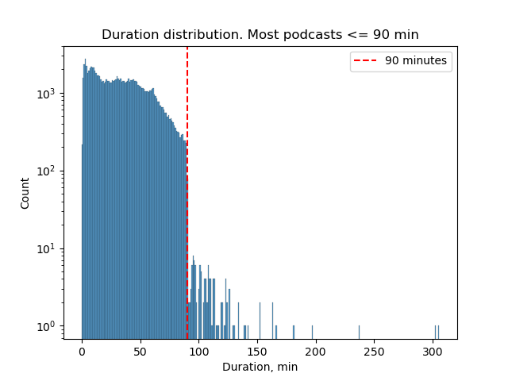
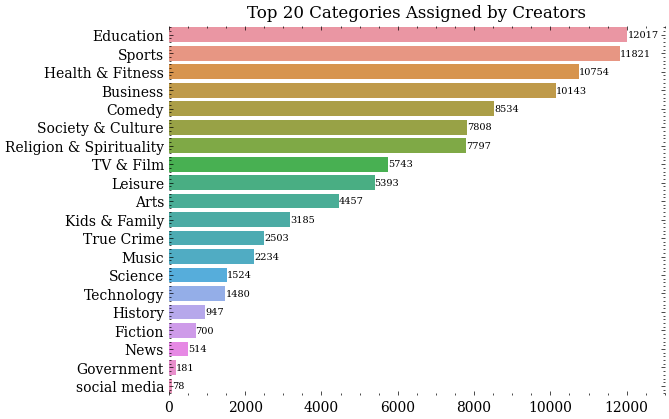
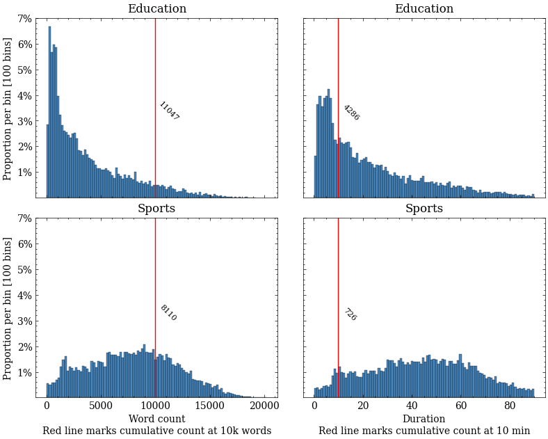
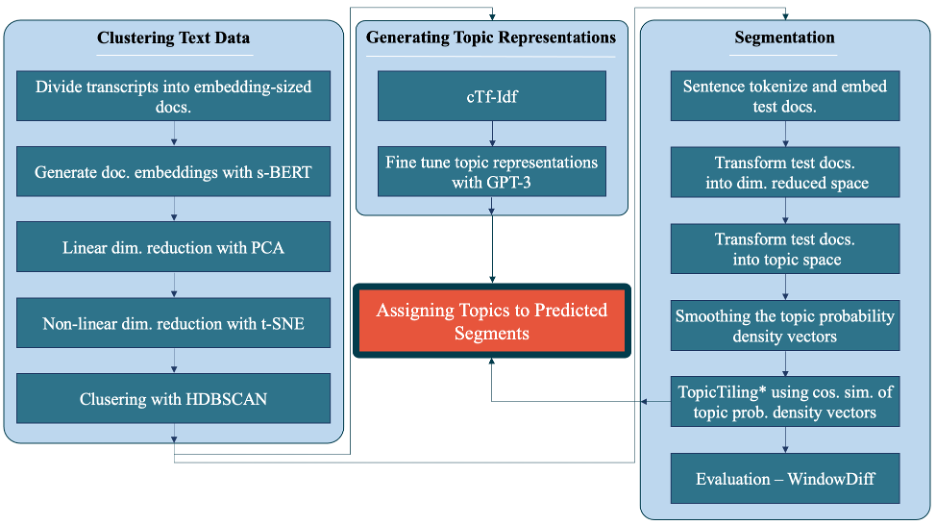
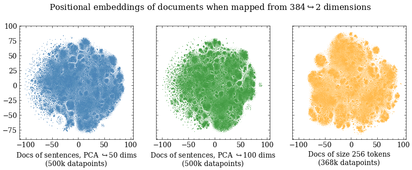
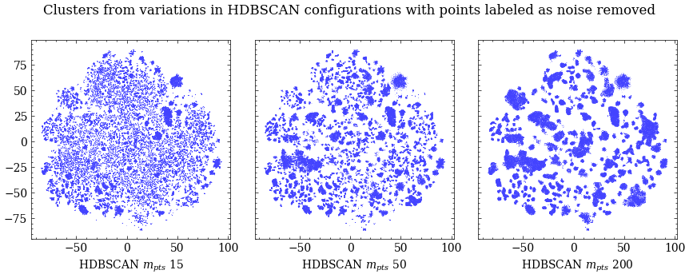
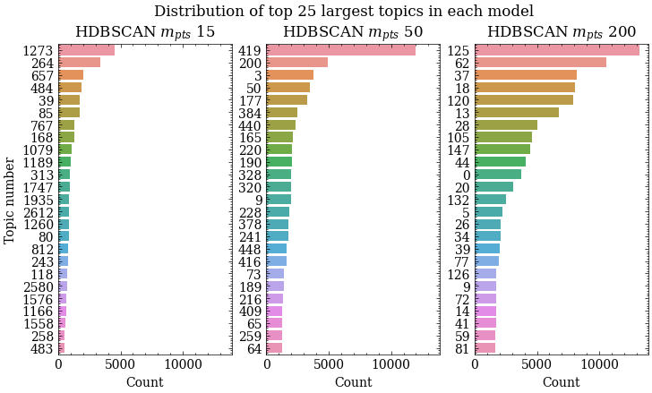
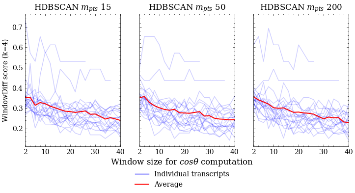
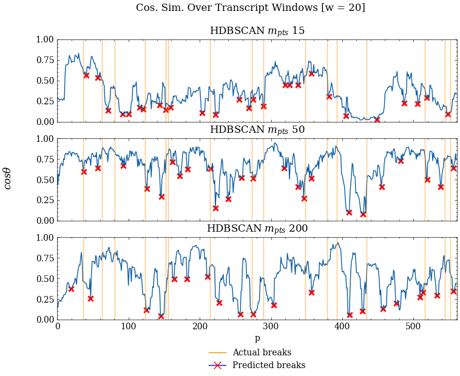

# Data-Driven Podcast Advertising: A Novel Framework
## Exploring the Potential of Topic Modelling and Text Segmentation for Native Ad Placement

Below follows some initial analyis.

## Repository file structure
0: Preprocessing and data wrangling  
1: Explorative data analysis  
2: Topic modelling -  our own implementation of the BERTopic pipeline  
3: Analysis of topic models  
4: Modified topic tiling implementation to be used with transformer based topic modelling  

## Project summary
The growing podcast industry necessitates innovative advertising strategies, prompting this study to explore the use of data science methods to enable native advertisement placement, in which ads align with the surrounding content. This research seeks to locate advertisement spots at points of topical shifts as well as assign meaningful topics to the content surrounding those shifts in podcast transcripts. A transformer-based clustering approach, integrated with a text segmentation algorithm, is developed for this purpose, advancing previous literature in text segmentation. By modelling the Spotify Podcast Dataset, the developed methodology’s ability to identify meaningful advertisement spots in podcasts and assign topics from the corpus to these segments is validated. This proof-of- concept study not only technically enables native advertising but also proposes a business framework for its monetization, outlining potential integration into podcast platforms. The study also positions the relevance of the methodology in relation to network effects and platform theory.

### Research questions
RQ 1: How can data science methods locate topical shifts in podcast transcripts?
RQ 2: How can data science methods find topics that are meaningful for podcast advertisement?

## Dataset 
In order to explore these two quesitons, we have used the Spotify Podcast Dataset which have the following properties: 

* Number of unique shows: 18290
* Number of unique publishers: 17490
* Languages: 20
* Number of episodes: 105360
* Max no episodes of one show: 1072, Min: 1
* Number of shows represented by only one episode: 8632
* Number of shows represented by less than 10 episodes: 16354

The dataset contains transcriptions of 105 360 podcasts from mainly English speaking shows from 18 290 different shows.

Almost all podcasts have a duration of less than 90 minutes. A uniform distibution up to ~60 minutes is prevalent.

In the data we see that there are a large discrepancy in topic distributions assigned by the authors: 

We are going to have to subset the data due to computational constraints. 
Lets investigate the word count and duration distributions of the two largest categories to find an appropriate subset.

We see that even though the education category contain more transcripts, the sports category transcripts are on average longer. Therefore we have chosen to subset the data according to the sports category for all downstream tasks. 

Now when we have a suitable subset for the tasks that we want to perform, we can present our modelling framework.

The first step after deviding all the transcripts into embedding-sized-documents are to embedd them using the all-MiniLM-L6-v2 pre-traines s-BERT from huggingface. After that we reduced dimensionality in a two step approach using PCA and t-SNE to limit computational complexity in succeeding steps.

After applying HDBSCAN to the embeddings with three different configurations of the hyperparamteres, we get the following clusters after removing noise: 

The topic cluster sizes have the following distribution of the 25 top topics of each HDBSCAN model: 

Some stats about the clusters from the three cluster models

| mpts        | No. clusters   | Noise  | Largest cluster | Silhouette score
| ------------- |:-------------:| :-----:|:----: | :-----:
| 15      | 2881 |  179935| 4521 | 0.4315
| 50      | 556      |   185500 |11970 | 0.3564
| 200 | 156      | 181389 |13255 | 0.3625

After applying TopicTiling* according to our modified version that makes use of topic probability density vectors from the transformer based clustering with HDBSCAN, we get the following WindowDiff score when testing out different configurations of the window paramteter in TopicTiling* and the Mpts hyperparameter of HDBSCAN: 

based on the above plot we see that different m_pts configuraitons barely make any difference but altering the window parameter does. We observe a negative exponential relationship between WindowDiff and window size for all models. After the window is increased to 20, we see less of an improvment. Therefore, we have selected a model with window size = 20 for all forthcomming evaluation. 

As previously discussed, increasing or decreasing the value of m_pts in HDBSCAN did not improve the WindowDiff score. However, it does increase the size of the drops in cosine similarity that segment breaks are predicted at and the number of predicted boundaries. In the figure below we observe the cosine similarity between windows over all positions sequentially plotted for one of the annotated transcripts as the blue line. The red crosses describe where boundaries are predicted to be allocated and the actual boundaries are shown as yellow vertical lines. For these three pipeline configurations, the number of predicted breaks decrease as the minimum cluster size increase. For m_pts=15 we get 27 boundaries, for m_pts=50 we get 24 and for m_pts=200 we get 20 in this specific transcript consisting of 600 sentences. Furthermore, as m_pts increase from 15 to 200, the range that the cosine similarity takes on increase from [0.02, 0.831] to [0.045, 0.934]. Clustering with m_pts= 50 gets a range with values in the middle of the two.

## Sit tight! More to come, work in progress :) 