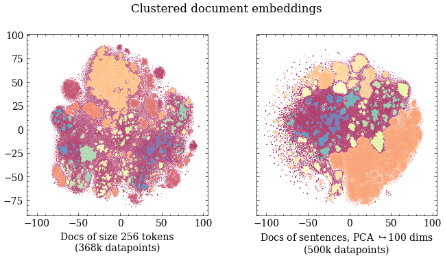

# Transformer Based Topic Modelling and Dynamic Segmentation of Speech-to-Text Transcribed Data
## Applications for Effective Podcast Monetization

Below follows some initial analyis.

## Some descriptive stats of the metadata

**Data in numbers:**

Number of unique values
* show_name    18290
* show_description    18322
* publisher    17490
* language    20
* episode_uri    105360
* episode_name    103660
* Max no episodes of one show    1072, Min    1
* Number of shows represented by only one episode    8632
* Number of shows represented by less than 10 episodes    16354

So, among else, we see that we have 105 360 podcasts from 18 290 different shows. 

Almost all podcasts have a duration of less than 90 minutes. A uniform distibution up to ~60 minutes is prevalent.

In the data we see that there are a large discrepancy in topic distributions assigned by the authors: 

We are going to have to subset the data due to computational constraints. 
Lets investigate the word count and duration distributions of the two largest categories to find an appropriate subset.

We see that even though the education category contain more transcripts, the sports category transcripts are on average longer. Therefore we have chosen to subset the data according to the sports category for all downstream tasks. 

Embedding the documents with BERT and reducing dimensionality in a two step approach using PCA and t-SNE. 

After applying HDBSCAN to the embeddings with two different configurations, we get the following topics: 

## Sit tight! More to come, work in progress :) 