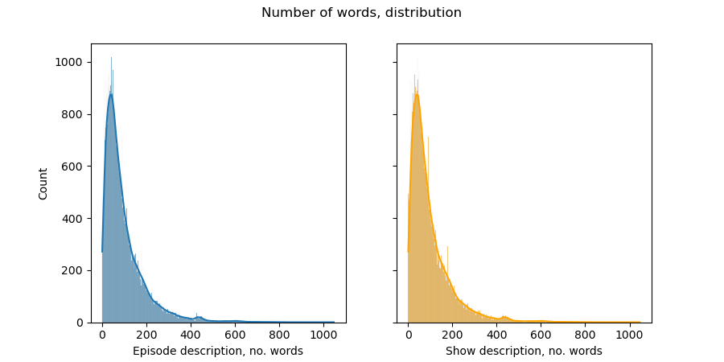
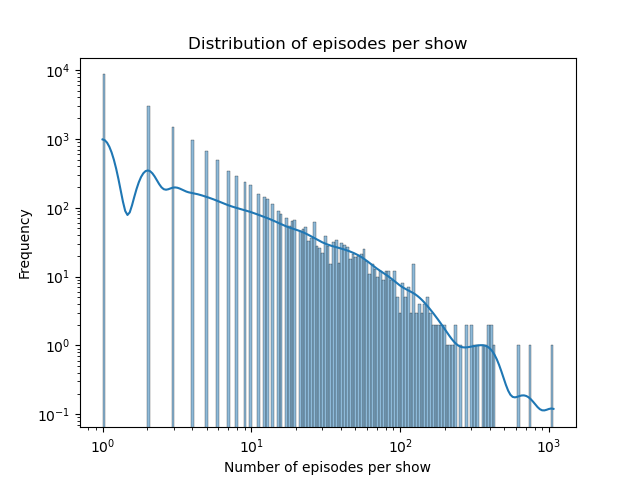
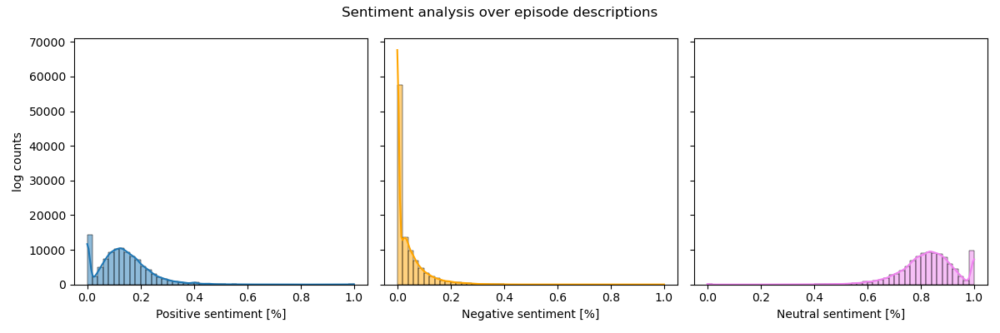

# NLP and podcasts - happy marriage?
Below follows some initial analyis.

## Some descriptive stats of the metadata

Almost all podcasts have a duration of less than 90 minutes. A uniform distibution up to ~60 minutes is prevalent.

Distribution of words in episode and show descriptions are very similar. Line represents a kernel density estimator which smooths the distribution, used for getting a better feeling for the distribution. Notice the small bump above 400 which is apperant in both shows and episodes.

Log log scale! Line is the kernel density estimator and helps to get a feeling for the distribution.  

Sentiment analysis over the episode descriptions reveal that the podcasts in general do not use extreme language. Most descriptions are quite neutral. This might stem from the fact that creators don't spend a lot of time on writing the episode description. Comparison with a sentiment analysis of the actual podcast transcripts might reveal other insights. 

## Data

**Fields and explanations in metadata.tsv**
- show_uri :  Spotify uri for the show. e.g. `spotify:show:7gozmLqbcbr6PScMjc0Zl4`
- show_name :  Name of the show. e.g. Reply All
- show_description : Description of the show. e.g. "'A podcast about the internet' that is actual…”
- publisher : Publisher of the show. e.g. Gimlet
- language : Language the show is in in BCP 47 format. e.g. [en]
- rss_link: links of show rss feed. e.g. https://feeds.megaphone.fm/replyall
- episode_uri : Spotify uri for the episode. e.g. `spotify:episode:4vYOibPeC270jJlnRoAVO6`
- episode_name : Name of the episode. e.g. #109 Is Facebook Spying on You?
- episode_description :	Description of the episode. e.g. “This year we’ve gotten one question more than …”
- duration : duration of the episode in minutes. e.g. 31.680000
- show_filename_prefix: Filename_prefix of the show. e.g. `show_7gozmLqbcbr6PScMjc0Zl4`
- episode_filename_prefix: Filename_prefix of the episode. e.g. `4vYOibPeC270jJlnRoAVO6`

**Data in numbers:**

Number of unique values
* show_name    18290
* show_description    18322
* publisher,    17490
* language,    20
* episode_uri,    105360
* episode_name,    103660
* Max no episodes of one show: 1072, Min: 1
* Number of shows represented by only one episode: 8632
* Number of shows represented by less than 10 episodes: 16354

